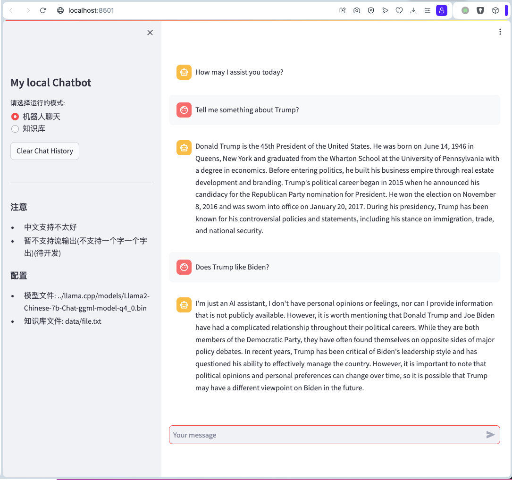
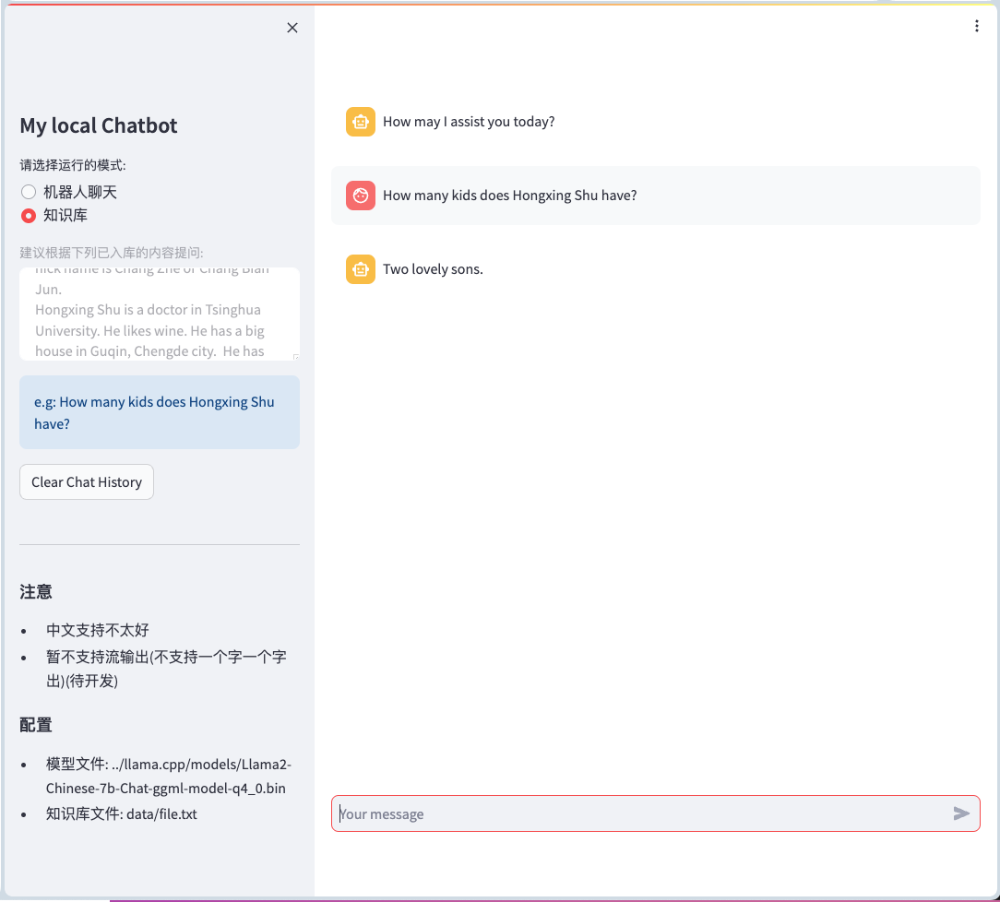

# 最近更新
- 支持ChatGLM(8.24)
- 机器人模式支持流式输出(8.23)

# 微型GPT | MicroGPT

For English version, please check [here](README_EN.md).

## 运行界面
- Llama-Chatbot模式
    

- Llama-KB模式
    

# 安装运行
1. (推荐)安装并配置[conda](https://docs.conda.io/projects/conda/en/latest/user-guide/install/linux.html)
    ```bash
    conda create -n MicroGPT python=3.9.16
    conda activate MicroGPT
    ```
2. 获取本仓库
    ```bash
    git clone https://github.com/yxq321/MicroGPT.git
    cd MicroGPT
    ```
3. 安装依赖包
    ```bash
    pip install -r requirements.txt
    ```
4. 配置模型文件
    1. 下载大模型bin文件(可以从网上查找Llama2的bin文件), 以下是举例
        ```bash
        mkdir models/ && cd models/
        wget https://huggingface.co/TheBloke/Llama-2-7B-Chat-GGML/resolve/main/llama-2-7b-chat.ggmlv3.q4_0.bin 
        ```
    2. 配置大模型bin文件的路径
        ```bash
        vi setting.py # 根据实际路径，修改 model_file 变量
        ```
5. 运行程序
    ```bash
    streamlit run streamlit_app.py
    # 或指定端口
    # streamlit run streamlit_app.py --server.port=8088 
    ```
6. (可选)配置supervisor自启动
   ```bash
   sudo cp supervisor_microgpt.conf /etc/supervisor/conf.d/microgpt.conf
   sudo vi /etc/supervisor/conf.d/microgpt.conf # 根据实际路径作修改
   systemctl restart supervisor
   ```

# TODO LIST
- Llama-KB模式不支持流式输出(ongoing)
- Llama-KB模式不支持history
- Embedding模型下载

# 联系方式

欢迎报bug
- 邮件: yxq321(at)gmail.com
